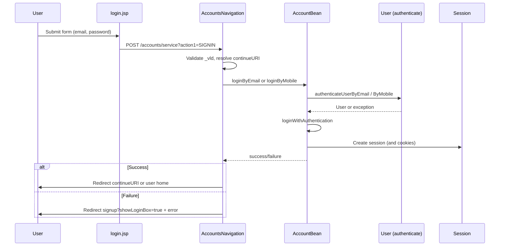
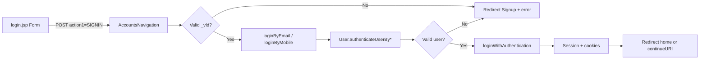

```mermaid
sequenceDiagram
    participant User
    participant login_jsp as login.jsp
    participant AccountsNav as AccountsNavigation
    participant AccountBean
    participant User_Class as User (authenticate)
    participant Session

    User->>login_jsp: Submit form (email, password)
    login_jsp->>AccountsNav: POST /accounts/service?action1=SIGNIN
    AccountsNav->>AccountsNav: Validate _vld, resolve continueURI
    AccountsNav->>AccountBean: loginByEmail or loginByMobile
    AccountBean->>User_Class: authenticateUserByEmail / ByMobile
    User_Class-->>AccountBean: User or exception
    AccountBean->>AccountBean: loginWithAuthentication
    AccountBean->>Session: Create session (and cookies)
    AccountBean-->>AccountsNav: success/failure
    alt Success
        AccountsNav->>User: Redirect continueURI or user home
    else Failure
        AccountsNav->>User: Redirect signup?showLoginBox=true + error
    end
```

```mermaid
flowchart LR
    A[login.jsp Form] -->|POST action1=SIGNIN| B[AccountsNavigation]
    B --> C{Valid _vld?}
    C -->|No| D[Redirect Signup + error]
    C -->|Yes| E[loginByEmail / loginByMobile]
    E --> F[User.authenticateUserBy*]
    F --> G{Valid user?}
    G -->|No| D
    G -->|Yes| H[loginWithAuthentication]
    H --> I[Session + cookies]
    I --> J[Redirect home or continueURI]
```

---
